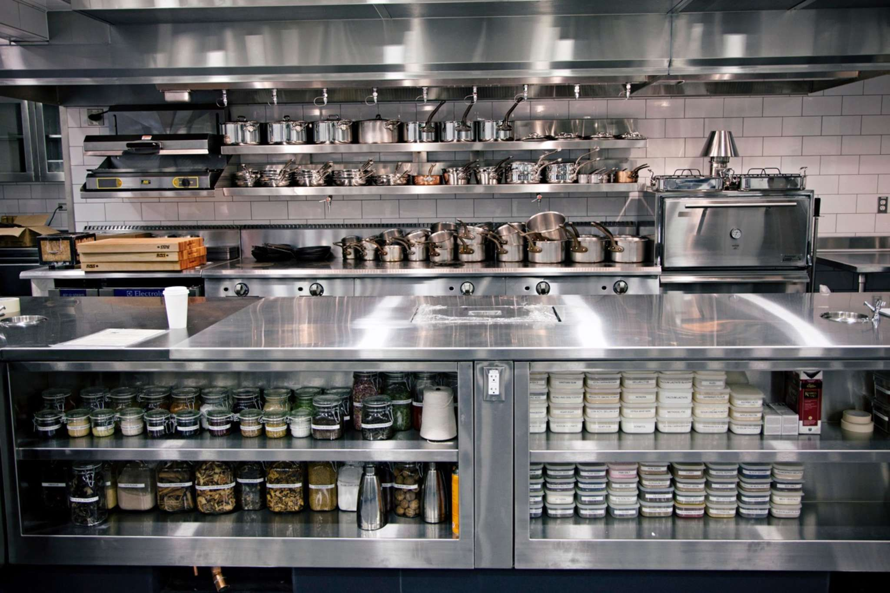

I've spent most of my working life in restaurants. The first restaurant I've ever worked at was Sumo Ramen at the age of 15. Since then, I've been a server at multiple fine dining high end restaurants, corporate chains, and small to medium mom & pops spots. When working at a new restaurant, the most important aspect that I would evaluate, from day one, was the logic of the operational standards to be enforced. The best restaurants typically held the highest standards with thoroughly detailed procedures and a deep understanding of the reasoning behind them. As Nobu management would say in reference to how service should flow, "like a well oiled machine". The proper use of detailed operating standards allowed each individual role to work with an understanding of every circumstance that may occur and what procedure would follow. This made for an incredibly smooth experience that celebrities and the wealthy would return for. The food was pretty great too, of course.

   
  
   
    *In Japanese cuisine, there are standards as to how a dish should be presented, not just created. Every aspect is considered in order to create pleasant 'art'.
   

Much like the operational standards that I've come to understand deeply, coding standards are highly valuable for a similar purpose and reason. Coding standards allow any individual to be able to comfortably understand the flow of a program, consistency within organizations to allow greater efficiency and readability, and ensure higher levels of program and network security. Realistically, I've mostly used IDE's since the beginning of my journey as a programmer, which is only around 3 years so far. So, I'm certain that I am yet to fully understand and appreciate the true value of coding standards. When I will have to collaborate with others on a team, I'm certain that my appreciation for coding standards will only grow. Though, even through the use of an IDE's auto format capability I've become accustomed to how code should look. Now, if I am to write out code on paper, I am automatically tuned to write cascading functions and if-statements with proper indentation like a visually pleasing waterfall. 

   
  
   

Now, on the flip side, I've worked at many restaurants that had little to no operational standards and this led to consistent conflict, complaints, hurt feelings, unkempt work environments, and opportunity loss. When there is a lack of operational standards, things that should be done, subjectively and lawfully, slip through the cracks and everyone loses in a way. Then, in the long run, everyone incurs more work or problems. I can imagine the same to happen if there were no coding standards or a lack of coding standards. We as a technological community would not have progressed as far as we have so far, due to less programs working efficiently or even at all. Collaboration within teams would be a nightmare as it would make for a loss of productivity and increase in debugging sessions. Cyber terrorism would be even more problematic for everyone. They say that "the Devil is in the details", but so is "God".

   
  
   

