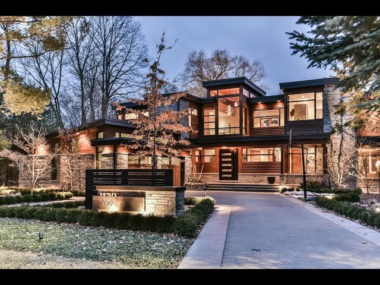
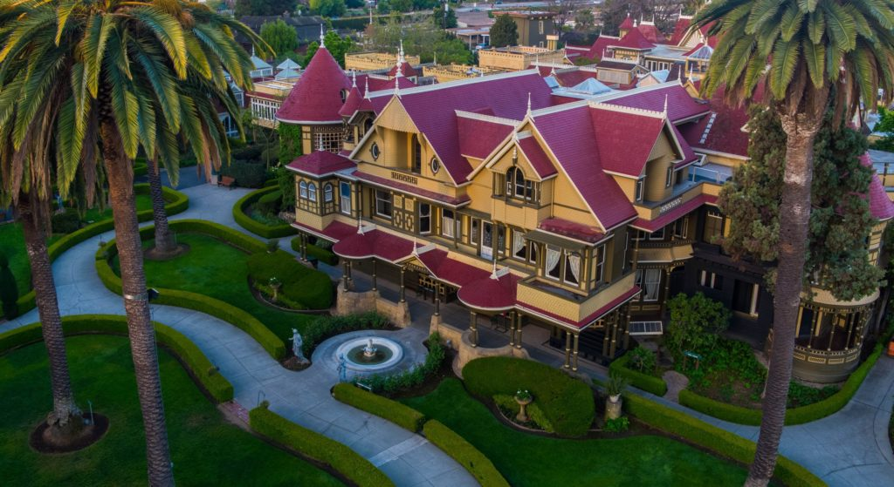
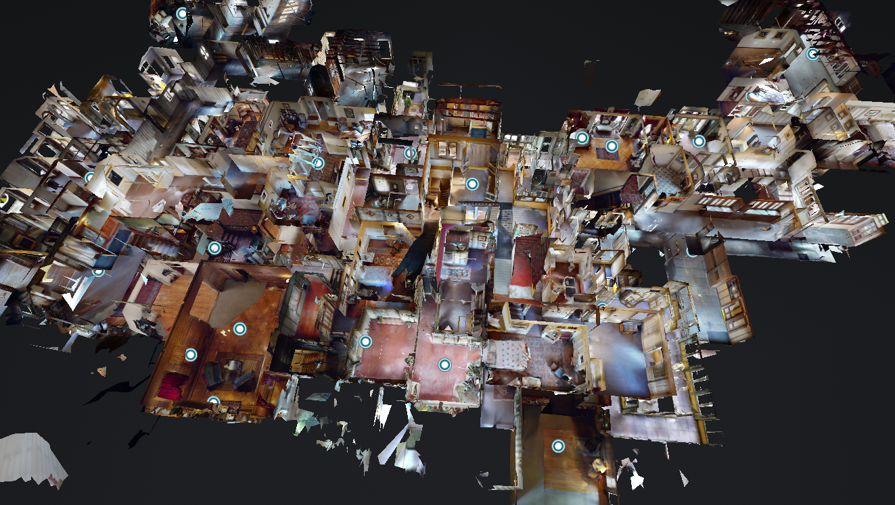

After spending some time working with raw HTML and CSS, then working with Bootstrap, I've come to understand that a framework is literally a frame to work in. By utilizing Bootstrap, it created specific standards that supported my beginner-ness by automating aspects of a user interface that I wouldn't have thought of and forcing me to respect the boundaries that has been set. If I were to use raw HTML and CSS, I may have been able to create some code very specific for the task or project, but it would have no adaptability and likely would take me a considerably longer time customizing each piece since I don't have the experience yet to group relevant pieces of the design together. Overall, as a beginner with little determination to specialize on the design of UI, I believe using a framework is the best option for me. Though, if my motivation was to be a Full-Stack Developer or a Front-End Developer, then I would opt for learning the ins and outs of raw HTML and CSS.

   
  
    
   
   

I see the utilization of a framework like Bootstrap being relevant to a custom house that follows the guidelines of a homeowner's association in a high end neighborhood. While there is still a high level of customization it is still limited by the rules set by the neighborhood. While this may be restricting, the difficulty in architectural blueprints are simplified by the rules that were previously set. Bootstrap is a highly functional framework that also has additional customization options by using tools like Sass, but ultimately still is work within a frame. 

   
  
   

Are you familiar with the Winchester Mansion in San Jose? It's a incredibly unique story about the heiress to the rifle fortune. After losing everyone close to her, her superstitiousness took over and forced her to do constant construction on her mansion, continuously creating new rooms with little architectural standards in order to trick the ghosts that she believed were after her. Ultimately ending with around 160 rooms. Some still believe that there is a fortune left somewhere in this maze of a house. This is the extent of what I see raw HTML and CSS to compare to in the contextual comparison to frameworks. It's the wild wild west out here and anything goes!  

   
  
  
   

