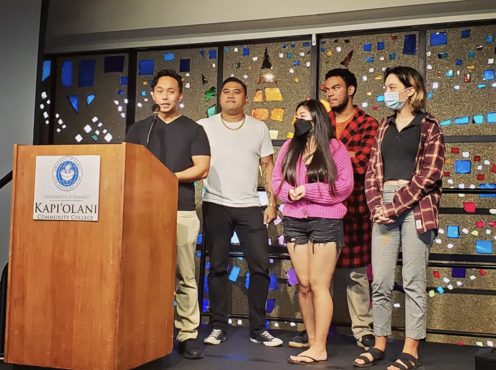
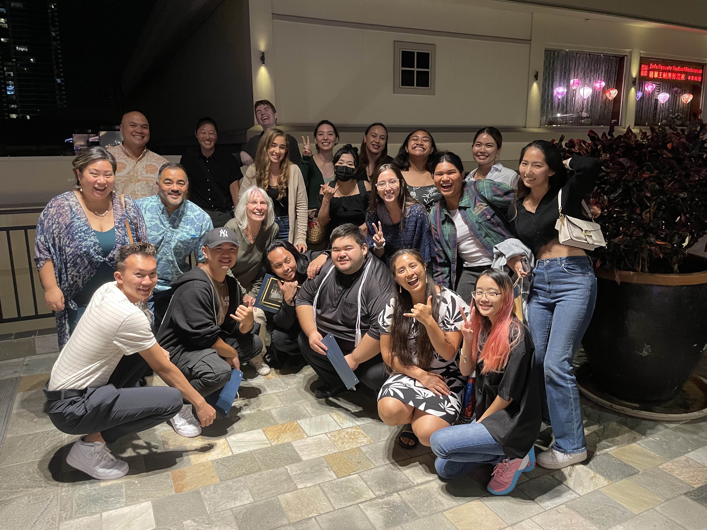

  
  
  

While attending Kapi'olani Community College, from 2020-2023, I was elected in to Student Congress as the Public Relations Manager in 2021, Vice President 2021-22, and Treasurer in 2022-23. I was able to put to use and further develop my professional leadership skills in event planning, team leadership, project management, and contracting. Of our most notable initiatives, we were able to provide new laptops and portable wi-fi to the library, a monthly newsletter containing upcoming events, resources, and opportunities available to students, assist with the Pohukaina Food Pantry(as food insecurity was consistently in the top stresses to students), and coordinate social events for students during the pandemic. 

My associate, and the President at the time, Jenny Brown also began the initiative to lower summer tuition rates for all campus', of which the effort is still continuing. The current(2023-24) Student Congress team recently spoke at the State Capitol to petition for funding, and out of a group of other college initiatives were the only community college to be approved of the first round. Another notable accomplishment was the revising of the charter and bylaws, which took a considerable amount of time to review. One of the difficulties came in the form of time restraint which limited us to the months of August - February to plan, execute, and evaluate our initiatives. By February, we were tasked with the evaluation and formulation of the Spring Survey that is sent out every year to students, which is used in the following year to evaluate the condition of and plan initiatives to support the student body. My time in Student Congress at Kapi'olani Community College was fulfilling mentally and emotionall, allowing me to receive other opportunities such as being featured on the EdSurge podcast and UH Community College commercial that is played on cable tv. 

<a href="https://kapionews.com/index.php/student-congress/">Kapi'olani Community College</a> 
<a href="https://www.instagram.com/kapccsc/">KapCCSC Instagram</a> 
<a href="https://www.instagram.com/reel/Cnxv-sAjBtk/?utm_source=ig_web_copy_link">UHCC: Returning Adults Commercial</a> 
<a href="https://www.audacy.com/podcast/kuilei-courageous-conversations-f869c/episodes/kapiolani-cc-student-congress-august-2022-a80dd">Kuilei Podcast August 2022</a> 
<a href="https://www.iheart.com/podcast/269-kuilei-courageous-conversa-50845178/episode/kapiolani-cc-student-congress-december-2022-106194248/">Kuilei Podcast December 2022</a> 
<a href="https://theedtechpodcast.com/252-edsurge-on-the-edtech-podcast-second-acts-series-episode-1/">EdSurge Podcast: Returning Adults</a> 
