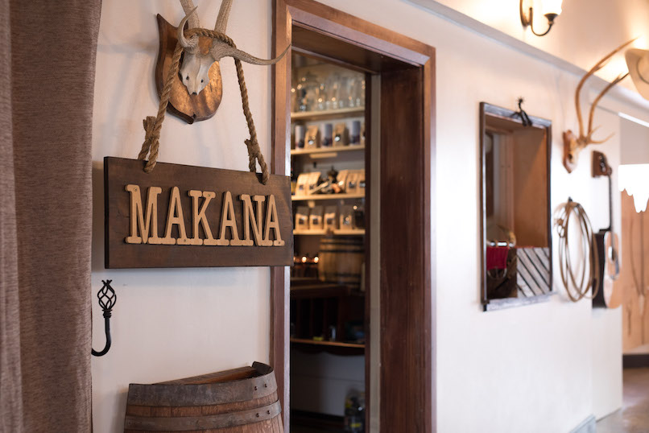
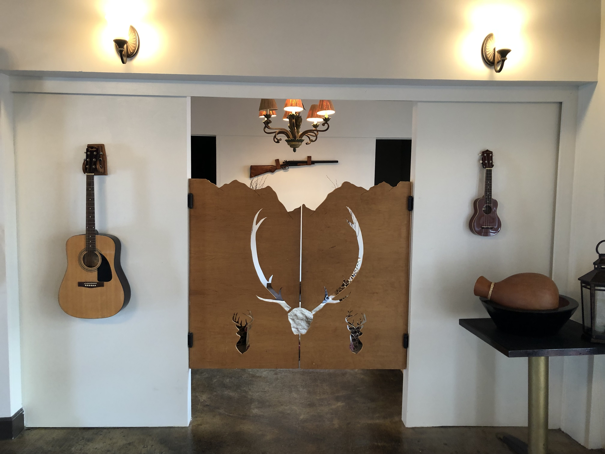
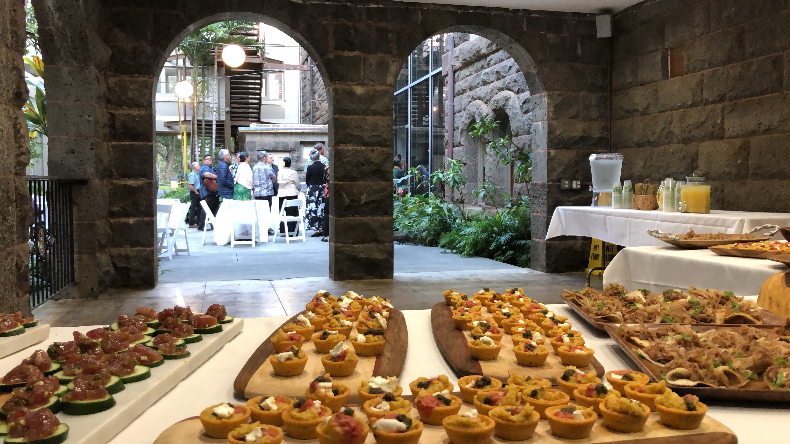
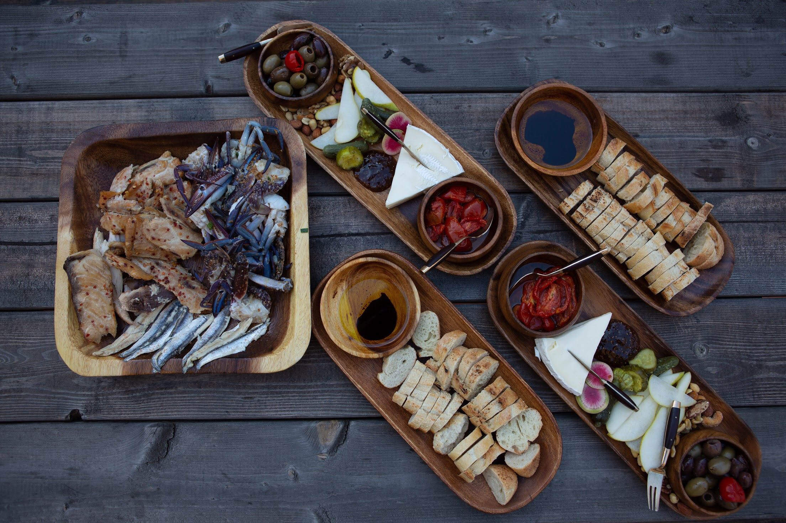
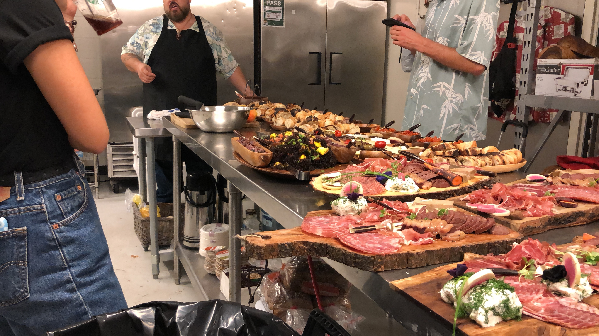

  
  
  
    
   
    
  
    
  

 
From 2018-19, I managed a pop-up Hawaiian fusion Tex-Mex restaurant, Makana Ranch House, located on Waialae Avenue. The restaurant mainly focused on special events, catering, and retail sales. Chef Ignacio was a hunter as well with the mission to make venison a mainstream meat source in Hawai'i by utilizing the over population of invasive Axis deer on the outer islands. 

I was able to use my extensive experience in the restaurant industry to manage back-end and front of the house operations for special occasions at the restaurant including weddings, birthdays, and wine-tastings, among other events. I often handled inventory for catering events, managed servers, and cooks. Of the catering events, the most unique were held at Bishop Museum and the Hawaii State Capitol, where I also met Governor Ige.

 
<a href="https://drive.google.com/drive/folders/19Dol958NKAfMsZAiIbN07Ho89fE0_61X?usp=sharing">Google Drive: Makana Ranch House</a> 
<a href="https://www.yelp.com/biz/makana-ranch-house-honolulu-2">Yelp: Makana Ranch House</a>

